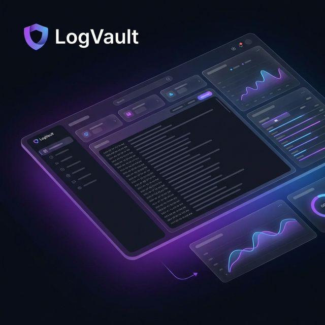

<div align="center">

# 🌌 LogVault

### Next-Gen Zero-Knowledge Log Intelligence & Premium Analytics

[](https://github.com/IDGUX/LogVault)
[](https://nextjs.org/)
[](LICENSE)
[](https://datadus.at)



**LogVault** is not just another log tool. It's a high-performance, aesthetically stunning log management system designed for the era of AI. It combines raw technical power with a premium, glassmorphic UI and deep AI-driven log interpretation.

[Explore Features](#-features) • [Getting Started](#-quick-start) • [Deployment](#-deployment) • [Join Community](https://github.com/IDGUX/LogVault/discussions)

</div>

---

## 🛠 Why LogVault?
Most log management tools are either "too big to fail" enterprise behemoths or bare-bones CLI scripts. **LogVault** bridges the gap. It is a focused, intelligent, and forensic-grade log vault for environments where every second of history matters.

---

## ✨ Features that Wow

### 🛰️ The "Blackbox" Flash-Archive (USB Sync)
LogVault acts like a **Flight Recorder** for your infrastructure. Enable "Auto-Sync" to mirror every incoming log message directly to an external USB drive in real-time. 
- **Forensic Ready:** Even if the server is compromised or the database wiped, your logs are safe on the physical "Blackbox" drive.
- **Offline Analytics:** Move the drive to any machine for air-gapped forensic analysis.

### 🧠 Zero-Knowledge AI Intelligence
Connect your choice of **OpenAI, Anthropic, Gemini, Mistral**, or even a **Local LLM (Ollama)**. LogVault interpret logs in real-time, providing deep security insights and suggested patterns without compromising your privacy.

### 🎨 Premium "Glass" Aesthetics
Built for developers who care about design. A fully responsive, vibrant, glassmorphic interface that feels more like a command center than a dashboard.

### 🛰️ Native Syslog Ingestion
Universal compatibility. Ingest logs from servers, gateways, IoT devices, or web apps. LogVault acts as a central hub for your entire infrastructure.

### 🔔 Smart Webhook Alarms
Get notified where it matters. Configure smart alarms that fire based on AI-determined severity levels, sent directly to Slack, Discord, or any custom webhook.

---

## 🚀 Quick Start

### 1. Zero-Config Install
```bash
git clone https://github.com/IDGUX/LogVault.git
cd LogVault
npm install
```

### 2. Initialize Core
```bash
npx prisma db push
```

### 3. Ignite
```bash
npm run dev
```

---

## 🐳 Deployment

Deploy anywhere in seconds. LogVault is optimized for Docker and Proxmox environments.

```yaml
# docker-compose.yml
services:
  logvault:
    image: idgux/logvault:latest
    ports:
      - "3000:3000"
      - "514:5140/udp"
    environment:
      - JWT_SECRET=your_ultra_secure_secret
```

---

## 💾 Backup & Persistence

LogVault uses SQLite for simplicity and high performance. Your data is protected through Docker volumes.

### Data Persistence
Base configurations and logs are stored in a Docker volume `sqlite_data`. This ensures your data survives container updates and restarts.

### Manual Backup
To create a manual snapshot of your database, run:
```bash
docker cp log-tool:/app/prisma/prod.db ./backup_logvault_$(date +%F).db
```

To restore a backup, simply copy it back to the volume or replace the file in your mounted directory.

---

## 🛠 Tech Stack

- **Framework:** Next.js 15 (App Router)
- **Database:** SQLite + Prisma ORM
- **Intelligence:** OpenAI, Anthropic, Gemini, Mistral, Ollama
- **Styling:** Tailwind CSS + Glassmorphism
- **Real-time:** UDP Syslog Receiver

---

## 🌐 Powered by Datadus

Created with ❤️ by [Datadus](https://datadus.at). We build IT-Automation and AI-Agents that actually work.

---

<div align="center">
  <sub>Built with LogVault. Star if you love it! ⭐</sub>
</div>
